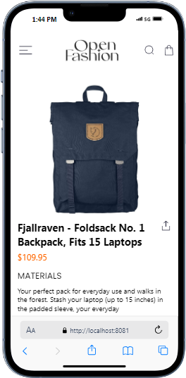

# Shopping Cart App

This app is a simple shopping cart application built with React Native. It allows users to view a list of available products, add products to their cart, remove products from their cart, and view the items in their cart. The selected items are stored locally on the device using AsyncStorage.

## Features

- **HomeScreen**: The HomeScreen displays a list of available products.
- **CartScreen**: The Cartscreen displays the selected items in the cart.
- **Add to Cart Button**: This button llows users to add products to their cart from the HomeScreen.
- **Remove from Cart Button**: This button also allows users to remove products from their cart on the CartScreen.
- **Local Storage**: Uses AsyncStorage to store the selected items locally on the device even after refreshing the application.

## Design Choices

- **User Interface**: The app features a simple and intuitive interface with two main screens: HomeScreen and CartScreen. This design ensures a straightforward user experience for viewing products and managing the cart.
- **Component-Based Architecture**: The app is structured with reusable components for the product list, Proudct items, and buttons. This promotes maintainability and scalability.

## Data Storage Implementation

- **AsyncStorage**: The app uses AsyncStorage for storing selected items in the cart. This choice ensures that the cart data persists across app sessions and remains available even if the app is closed and reopened.
  - **Add to Cart**: When a product is added to the cart, the app updates the AsyncStorage with the new list of selected items.
  - **Remove from Cart**: When a product is removed from the cart, the app updates the AsyncStorage to reflect the change.

## How to Run the App

1. **Clone the repository**: `git clone  https://github.com/Derryblinks/-rn-assignment6-11218606.git`
2. **Navigate to the project directory**: `my-app`
3. **Install dependencies**: `npm install` or `yarn install`
4. **Run the app**:
   - For iOS: `npx react-native run-ios`
   - For Android: `npx react-native run-android` or ` npm start`

## Screenshots

### HomeScreen

### CartScreen

### DrawerNavigation Screen

